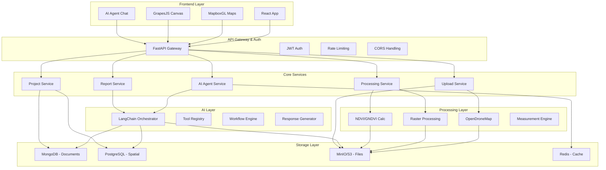
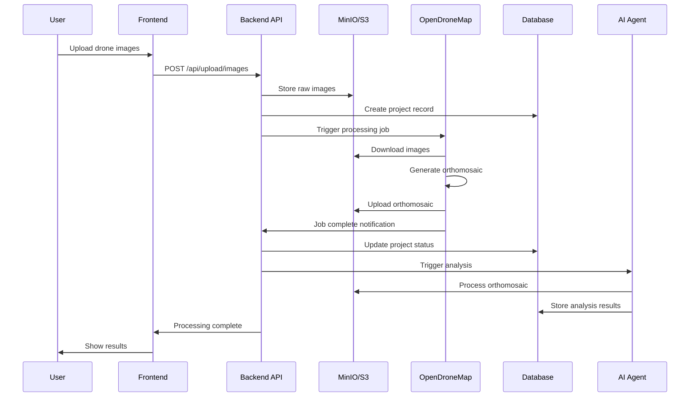
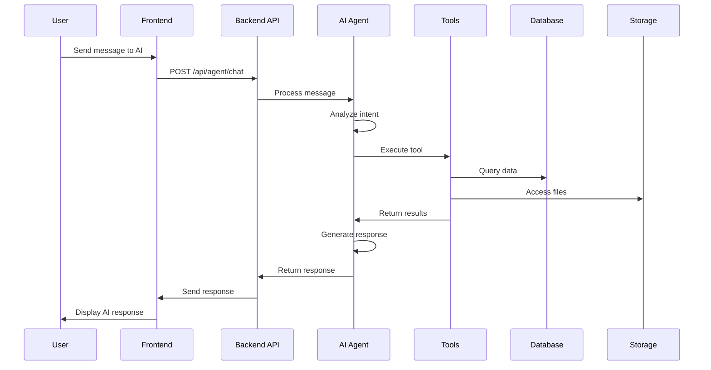
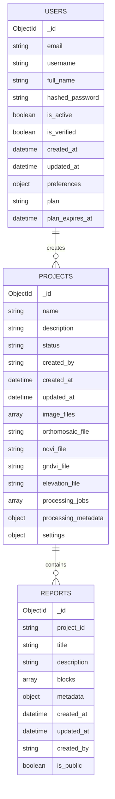
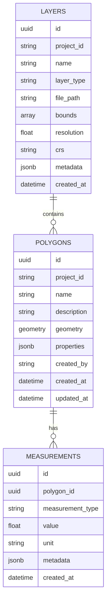
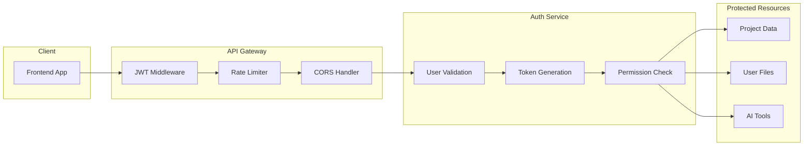
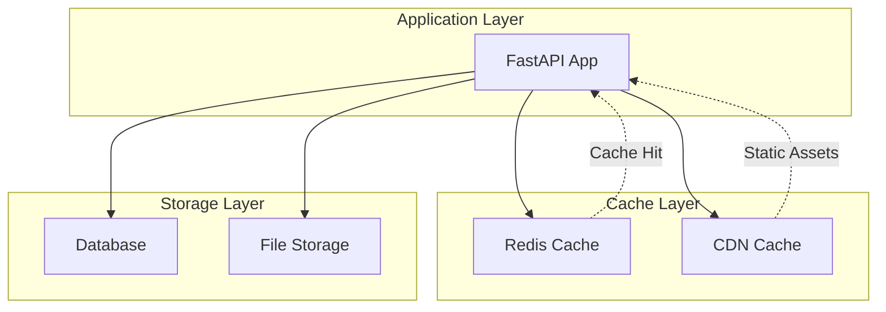
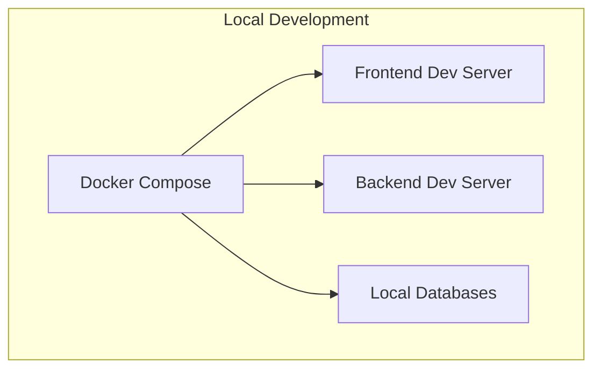
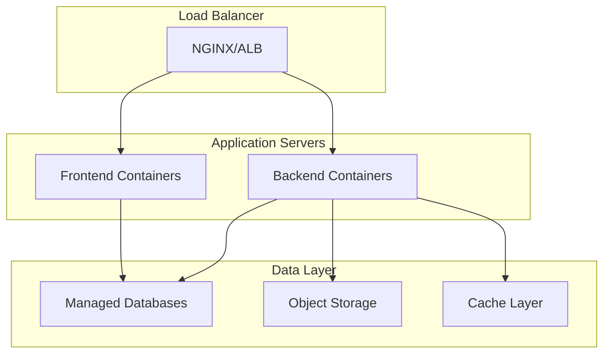

# Canopy Copilot - System Architecture

## 🏗️ High-Level Architecture



## 🔄 Data Flow Diagrams

### Image Upload & Processing Flow



### AI Agent Interaction Flow



## 🗄️ Database Schema

### MongoDB Collections (Documents)



### PostgreSQL Tables (Spatial Data)



## 🔧 Service Architecture

### Backend Service Structure

```
backend/
├── main.py                 # FastAPI application entry point
├── api/                    # API layer
│   ├── routes/            # Route handlers
│   │   ├── auth.py        # Authentication endpoints
│   │   ├── upload.py      # File upload endpoints
│   │   ├── projects.py    # Project management
│   │   ├── maps.py        # Spatial data endpoints
│   │   ├── canvas.py      # Report canvas endpoints
│   │   └── agent.py       # AI agent endpoints
│   └── middleware/        # Custom middleware
├── agent/                  # AI agent layer
│   ├── tools.py           # Agent tools implementation
│   ├── workflow.py        # Agent workflow orchestration
│   └── prompts.py         # AI prompts and templates
├── db/                     # Database layer
│   ├── database.py        # Connection management
│   ├── models.py          # Data models
│   └── migrations/        # Database migrations
├── jobs/                   # Background processing
│   ├── celery_app.py      # Celery configuration
│   ├── odm_tasks.py       # OpenDroneMap tasks
│   └── raster_tasks.py    # Raster processing tasks
├── odm/                    # OpenDroneMap integration
│   ├── client.py          # ODM API client
│   ├── processor.py       # Processing logic
│   └── validator.py       # Input validation
├── raster/                 # Raster processing
│   ├── ndvi.py            # NDVI calculation
│   ├── gndvi.py           # GNDVI calculation
│   └── statistics.py      # Raster statistics
└── utils/                  # Utilities
    ├── config.py          # Configuration management
    ├── storage.py         # S3/MinIO utilities
    └── helpers.py         # Common helpers
```

### Frontend Component Structure

```
frontend/src/
├── components/             # Reusable components
│   ├── common/            # Common UI components
│   ├── map/               # Map-related components
│   ├── canvas/            # Canvas editor components
│   └── agent/             # AI agent components
├── pages/                  # Page components
│   ├── Dashboard.jsx      # Main dashboard
│   ├── Upload.jsx         # File upload page
│   ├── Projects.jsx       # Project listing
│   ├── ProjectDetail.jsx  # Project details
│   ├── Map.jsx            # Interactive map
│   ├── Canvas.jsx         # Report canvas
│   ├── Agent.jsx          # AI agent interface
│   ├── Login.jsx          # Authentication
│   └── Register.jsx       # User registration
├── hooks/                  # Custom React hooks
├── utils/                  # Utility functions
├── store/                  # State management
└── types/                  # TypeScript type definitions
```

## 🔐 Security Architecture

### Authentication & Authorization



### Data Security

- **Encryption at Rest**: All sensitive data encrypted in databases
- **Encryption in Transit**: HTTPS/TLS for all communications
- **Access Control**: Role-based access control (RBAC)
- **API Security**: JWT tokens, rate limiting, input validation
- **File Security**: Signed URLs for file access, virus scanning

## 📊 Performance Architecture

### Caching Strategy



### Scalability Considerations

- **Horizontal Scaling**: Stateless API services
- **Database Scaling**: Read replicas, connection pooling
- **File Storage**: CDN for static assets, S3 for large files
- **Processing**: Queue-based background jobs
- **Monitoring**: Metrics collection and alerting

## 🔄 Deployment Architecture

### Development Environment



### Production Environment



## 📈 Monitoring & Observability

### Metrics Collection

- **Application Metrics**: Response times, error rates, throughput
- **Infrastructure Metrics**: CPU, memory, disk, network
- **Business Metrics**: User activity, feature usage, processing times
- **AI Metrics**: Agent interactions, tool usage, response quality

### Logging Strategy

- **Structured Logging**: JSON format for easy parsing
- **Log Levels**: DEBUG, INFO, WARNING, ERROR, CRITICAL
- **Log Aggregation**: Centralized log collection and analysis
- **Log Retention**: Configurable retention policies

### Alerting

- **Infrastructure Alerts**: Service health, resource usage
- **Application Alerts**: Error rates, performance degradation
- **Business Alerts**: Processing failures, user issues
- **Security Alerts**: Unusual access patterns, security events

---

**Canopy Copilot** - Intelligent photogrammetry platform architecture. 🌱